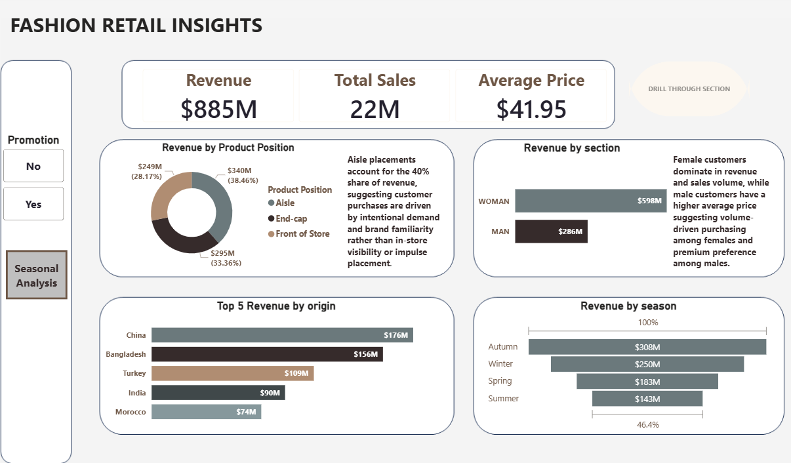
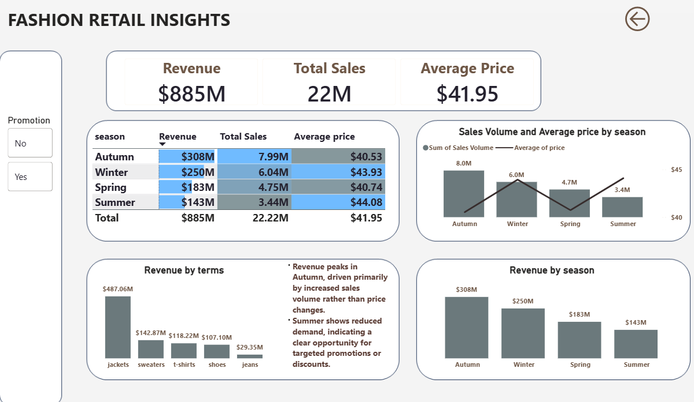
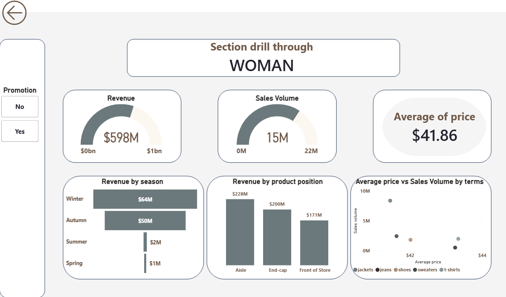
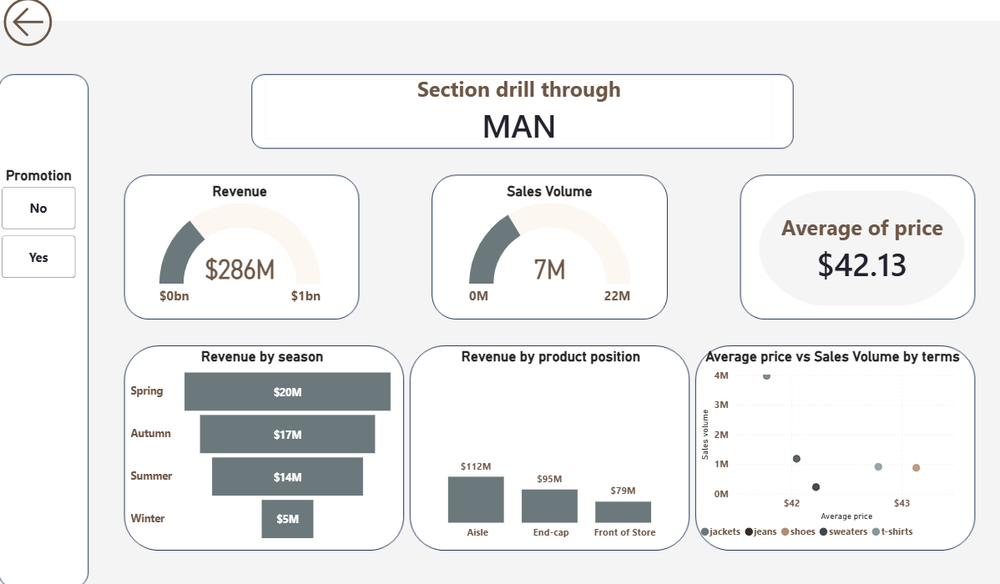

# 👗 Fashion Retail Insights — Power BI Dashboard

An end-to-end Power BI analytics project exploring **sales performance, pricing behavior, customer segments, seasonality, and product dynamics** within a fashion retail business.  
The dashboard combines high-level KPIs with **interactive drill-through analysis** for Men and Women product sections.

---

## 📌 Project Objective

The goal of this project is to:

- Analyze revenue and sales drivers across seasons  
- Compare purchasing behavior between **male and female customers**  
- Evaluate the impact of **product placement** on revenue  
- Identify high-performing product categories  
- Support data-driven decisions for pricing, promotions, and inventory planning  

---

## 📊 Dashboard Structure

### 1️⃣ Main Overview — *Fashion Retail Insights*

This page provides a **business-wide snapshot** of performance.

#### Key KPIs
- **Total Revenue:** $885M  
- **Total Sales Volume:** 22M units  
- **Average Price:** $41.95  

#### Key Visuals
- Revenue, Sales Volume, and Average Price by Season  
- Revenue by Product Category (Jackets, Sweaters, T-shirts, Shoes, Jeans)  
- Revenue by Season (Autumn, Winter, Spring, Summer)  
- Promotion slicer (Yes / No)  
- Navigation to Seasonal Analysis and Drill-Through pages  

#### Insight Highlights
- Revenue peaks in **Autumn**, driven mainly by increased sales volume rather than price changes.  
- **Summer shows the lowest demand**, indicating an opportunity for targeted promotions.  

---

### 2️⃣ Seasonal Analysis Page

This page focuses on **season-level performance comparison**.

| Season | Revenue | Sales Volume | Average Price |
|------|--------|--------------|---------------|
| Autumn | $308M | 7.99M | $40.53 |
| Winter | $250M | 6.04M | $43.93 |
| Spring | $183M | 4.75M | $40.74 |
| Summer | $143M | 3.44M | $44.08 |
| **Total** | **$885M** | **22.22M** | **$41.95** |

#### Key Insights
- **Autumn leads in both revenue and sales volume**, confirming strong seasonal demand.  
- **Winter and Summer have higher average prices**, suggesting premium pricing with lower volumes.  
- Sales volume contributes more to revenue growth than price changes alone.  

---

### 3️⃣ Drill-Through Page — WOMAN Section

This page provides a detailed analysis of **female customer purchasing behavior**.

#### Key Metrics
- **Revenue:** $598M  
- **Sales Volume:** 15M units  
- **Average Price:** $41.86  

#### Analysis Covered
- Revenue by Season  
- Revenue by Product Position  
- Average Price vs Sales Volume by Product Category  
- Promotion impact  

#### Insights
- Female customers generate the **majority of total revenue and sales volume**.  
- Revenue is strongest during **Winter and Autumn**.  
- **Aisle placement contributes the highest revenue**, suggesting planned purchasing behavior.  
- Buying behavior is largely **volume-driven rather than premium-driven**.  

---

### 4️⃣ Drill-Through Page — MAN Section

This page focuses on **male customer performance and purchasing patterns**.

#### Key Metrics
- **Revenue:** $286M  
- **Sales Volume:** 7M units  
- **Average Price:** $42.13  

#### Insights
- Male customers generate **lower volume but slightly higher average prices**.  
- Indicates a preference for **premium or higher-priced products**.  
- Aisle placement remains the top revenue driver, with competitive performance from end-cap positions.  
- Seasonal demand is more concentrated compared to female customers.  

---

## 🧠 Key Business Insights Summary

- **Women drive overall revenue and sales volume**, while men show higher average spending per item.  
- **Aisle placements account for the largest revenue share**, highlighting intentional purchasing behavior.  
- **Autumn and Winter are peak seasons**, critical for inventory and marketing planning.  
- **Summer underperformance** presents opportunities for discounts and promotional campaigns.  
- Jackets and sweaters are the highest revenue-generating product categories.  

---

## 🛠 Tools & Technologies

- **Power BI Desktop**  
- **DAX** (Measures and calculated fields)  
- **Excel / CSV** (Data source)  
- Interactive slicers, filters, and drill-through functionality  

---

## 🚀 How to Use

1. Download the `.pbix` file from this repository  
2. Open it using **Power BI Desktop**  
3. Use slicers (Promotion, Season) to filter data  
4. Right-click on **MAN** or **WOMAN** sections to drill through  
5. Explore seasonal and category-level insights  

---

## ✍ Author

**Onifade Oluwagbemiga**  
Medical Student | Data Analyst       
University of Lagos
